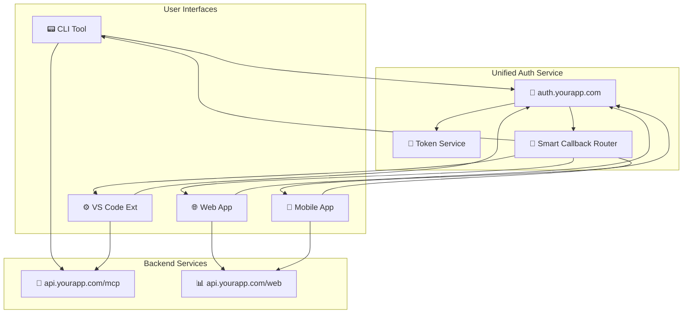

# Unified MCP Auth Architecture

## 🎯 Core Problem Solved
**Same auth flow regardless of interface** - CLI, web, VS Code extension, mobile, etc.

## 🏗️ Architecture Overview



## 🔧 Implementation Strategy

### **1. Unified Auth Domain Structure**
```
auth.yourapp.com/oauth/authorize  ← All interfaces start here
auth.yourapp.com/oauth/callback   ← All callbacks land here  
auth.yourapp.com/oauth/token      ← All token exchanges here
auth.yourapp.com/oauth/refresh    ← All token refreshes here
```

### **2. Interface Detection Pattern**
```typescript
// Each interface includes interface type in OAuth state
const authURL = `https://auth.yourapp.com/oauth/authorize?` +
  `client_id=${clientId}&` +
  `redirect_uri=${encodeURIComponent(callbackURL)}&` +
  `response_type=code&` +
  `state=${encodeURIComponent(JSON.stringify({
    interface: 'cli' | 'web' | 'vscode' | 'mobile',
    returnTo: originalContext,
    nonce: securityNonce
  }))}`
```

### **3. Smart Callback Router Logic**
```typescript
// auth.yourapp.com/oauth/callback
app.get('/oauth/callback', async (req, res) => {
  const { code, state, error } = req.query;
  const stateData = JSON.parse(decodeURIComponent(state));
  
  if (error) {
    return routeError(res, stateData.interface, error);
  }
  
  // Exchange code for tokens (same for all interfaces)
  const tokens = await exchangeCodeForTokens(code);
  
  // Route success based on interface type
  switch (stateData.interface) {
    case 'cli':
      return routeToCLI(res, tokens, stateData.returnTo);
    case 'web':
      return routeToWeb(res, tokens, stateData.returnTo);
    case 'vscode':
      return routeToVSCode(res, tokens, stateData.returnTo);
    case 'mobile':
      return routeToMobile(res, tokens, stateData.returnTo);
  }
});
```

### **4. Interface-Specific Callback Handling**

#### **CLI Callback Pattern**
```typescript
// CLI starts local server, auth service posts back to it
function routeToCLI(res, tokens, returnContext) {
  const callbackURL = `http://localhost:${returnContext.port}/auth-complete`;
  
  // POST tokens to CLI's local server
  fetch(callbackURL, {
    method: 'POST',
    headers: { 'Content-Type': 'application/json' },
    body: JSON.stringify({ tokens, success: true })
  });
  
  res.send(`
    <html>
      <body>
        <h2>✅ Authentication Successful!</h2>
        <p>You can close this window and return to your terminal.</p>
        <script>window.close();</script>
      </body>
    </html>
  `);
}
```

#### **Web App Callback Pattern**  
```typescript
function routeToWeb(res, tokens, returnContext) {
  // Set secure HTTP-only cookie with refresh token
  res.cookie('refresh_token', tokens.refresh_token, {
    httpOnly: true,
    secure: true,
    sameSite: 'strict',
    maxAge: 30 * 24 * 60 * 60 * 1000 // 30 days
  });
  
  // Redirect to web app with access token in URL fragment
  res.redirect(`https://app.yourapp.com/auth-success#token=${tokens.access_token}&return=${returnContext.path}`);
}
```

#### **VS Code Extension Callback Pattern**
```typescript
function routeToVSCode(res, tokens, returnContext) {
  // Use custom protocol handler
  const vscodeURL = `vscode://yourapp.vscode-extension/auth-complete?` +
    `access_token=${tokens.access_token}&` +
    `refresh_token=${tokens.refresh_token}&` +
    `context=${encodeURIComponent(JSON.stringify(returnContext))}`;
  
  res.redirect(vscodeURL);
}
```

## 🚀 **Claude Code Implementation Plan**

### **Step 1: Create Auth Service Structure**
```bash
mkdir auth-service
cd auth-service
npm init -y
npm install express cors helmet morgan jsonwebtoken
```

### **Step 2: File Structure**
```
auth-service/
├── src/
│   ├── routes/
│   │   ├── oauth.ts         ← OAuth endpoints
│   │   └── callback.ts      ← Smart callback router
│   ├── services/
│   │   ├── token.ts         ← JWT handling
│   │   └── oauth-client.ts  ← OAuth provider client
│   ├── middleware/
│   │   └── auth.ts          ← Auth middleware
│   └── app.ts               ← Express app
├── config/
│   └── environments.ts     ← Domain configs
└── package.json
```

### **Step 3: Environment Configuration**
```typescript
// config/environments.ts
export const config = {
  development: {
    authDomain: 'http://localhost:3001',
    apiDomain: 'http://localhost:3000', 
    webDomain: 'http://localhost:5173',
    allowedOrigins: ['http://localhost:5173', 'vscode://yourapp.vscode-extension']
  },
  production: {
    authDomain: 'https://auth.yourapp.com',
    apiDomain: 'https://api.yourapp.com',
    webDomain: 'https://app.yourapp.com',
    allowedOrigins: ['https://app.yourapp.com', 'vscode://yourapp.vscode-extension']
  }
};
```

## 🎯 **Quick Resolution Strategy**

**Would you like me to help you with Claude Code to:**

1. **🔍 Analyze your current auth setup** - Review existing code to identify routing issues
2. **🏗️ Build the unified auth service** - Create the centralized auth architecture above  
3. **🔧 Fix specific routing problems** - Debug the domain/callback issues you're hitting
4. **⚡ Implement interface adapters** - Create the CLI/web/VS Code specific handlers

**What's your current setup looking like? Are you using:**
- OAuth2 with a specific provider (GitHub, Google, Auth0)?
- Custom auth system?
- Specific frameworks (Express, Fastify, etc.)?
- Current domain structure causing the issues?

Share your current auth code structure and I'll help Claude Code pinpoint the exact routing fixes needed! 🚀